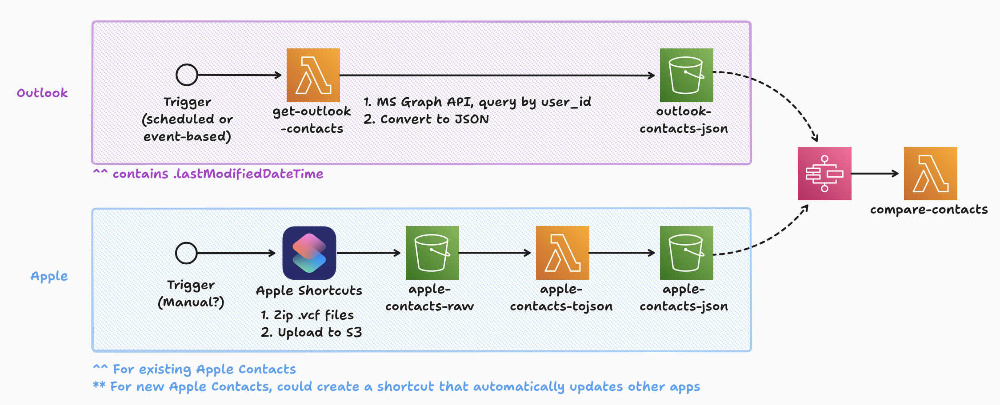

# Contacts Exporter

## Microsoft Graph API
Use Microsoft Graph API to extract all contacts

1. [Register an application on Azure Portal](https://learn.microsoft.com/en-us/entra/identity-platform/quickstart-register-app?tabs=certificate)
2. Install python packages in requirements.txt
3. Modify sample.env and rename to .env
4. Run the script `scripts/get_outlook_contacts.py`

## Apple Contacts
Use Apple Shortcuts to extract all contacts, and upload to S3 bucket

1. Install `Extract Contacts.shortcut` on iPhone or Mac
2. Share output file, add to input folder
3. Run `scripts/apple_contacts_tojson.py`

Note: Most apple shortcuts must be user-initiated, but there may be a clever way to trigger it automatically.

## Next Steps
1. Design for multi-user / multi-org architecture
2. Create scripts for other contact sources
3. Create aws-cdk script to build AWS solution:
   - Determine trigger event (scheduled, or event-driven)
   - Create Lambda functions for scripts, modify for Lambda processing
   - Upload contact files to S3 Buckets
   - Create API Gateway for uploading Apple zip file from shortcut
   - Set permissions